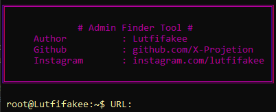

# adfindersan

[](https://www.python.org/)
[](LICENSE)
[](https://github.com/X-Projetion/CVE-2023-4596-Vulnerable-Exploit-and-Checker-Version/issues)

<p align="center">
    
</p>
<h4 align="center">Fast passive Finder Admin enumeration tool.</h4>

Adfindersan is an admin finder tool or looking for admin logins to make daily activities easier.
This script is designed to make it easier to search for admin logins or admin logins that use paths or wordlists that you create yourself and this admin search tool uses macros to make it easier to find your admin login, these macros use tags in your wordlist file which will later be used.
The macro name used is
- [Lutfifakee SUB]
- [Lutfifakee_SUBG]
- [Lutfifakee SUBC]

---

## Resources

- [Installation](#installation)
- [Usage](#usage)
- [Macro](#macro)
- [Disclaimer](#Disclaimer)

## Installation

```bash
git clone https://github.com/X-Projetion/adfindersan && cd adfindersan
pip install -r requirements.txt
```

## Usage
- python find.py

and enter the complete URL such as https://web.lutfifakee.com/ must use [/] at the end of the url.

## Macro
**[-] Could not extract forminator_nonce** <br>
The function of the macro tag is to retrieve the path from the URL.
Like https://web.lutfifakee.com/ the macro will take part of the subdomain URL which will later be used to find the path or admin login or admin login page.


## Disclaimer
The script provided is for educational purposes only, I am not responsible for your actions.

<br>

[instagram](https://www.instagram.com/lutfifakee/) - Made by X-Projetion
